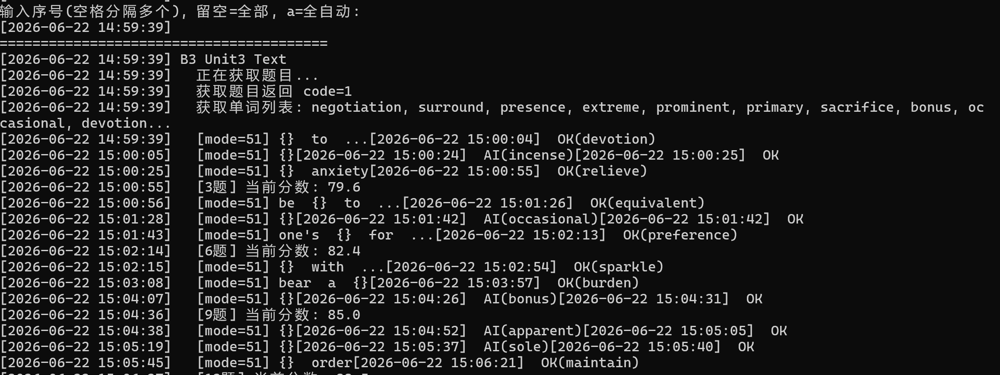

# Cidaren-AI - 词达人班级任务升级版

**如果有帮助别忘了点个 Star 🙏 qwq**

> 作者：小明同学

基于 [cidaren](https://github.com/moningf/cidaren) 二次开发，集成 AI 大模型答题，支持自动获取任务单词列表，大幅提升正确率。

> 本项目地址：[xm2284/cidaren-ai](https://github.com/xm2284/cidaren-ai)



## GitHub 上现有项目的 Bug

我在 GitHub 上下了好几个词达人的项目，发现**目前 GitHub 上面的都有以下 Bug**：

1. **任务判定错误** — 70 多分的任务被显示为"已完成"，根本不会刷。原项目用 `over_status != 3 and score != 100 and progress != 100` 判断，逻辑有误，导致低分任务被跳过
2. **全自动模式失效** — 输入 `a` 全自动后什么都不做，直接显示"全部完成"。`selected` 被设为空列表
3. **已截止任务仍被选中** — 过期的任务还会被拉出来刷，白费功夫
4. **SSL 超时卡死** — 网络波动时脚本直接卡住不动，没有任何重试机制
5. **选词后直接结束** — 遇到 `code=20001`（需要选词）时直接 break，选完词就当任务完成了，实际一道题都没答，分数为 0
6. **学习卡片太慢** — 逐张等待跳过，一张卡等好几秒
7. **网页版 emoji 乱码** — 部分项目（如 LangQi99 的 Web 版）在 Windows 终端输出 emoji 时报 `UnicodeEncodeError: gbk codec can't encode character`，直接崩溃
8. **AI 答题用错字段** — 推理模型（如 mimo）的 `reasoning_content` 是思考过程，不是答案，有的项目把它当答案提交了

## 本项目修复了什么

针对上面所有 Bug，本项目逐一修复并增强：

| Bug | 修复方式 |
|-----|---------|
| 任务判定错误 | 改为 `score < 100` 判断，70 多分的任务正常显示为待做 |
| 全自动失效 | 输入 `a` 时自动选中所有 `score < 100` 的任务 |
| 已截止任务被选中 | 新增 `_is_task_expired()` 函数，用 `start_time + over_time` 判断是否过期 |
| SSL 超时卡死 | 5 次重试 + 递增等待（2s→6s）+ 20 秒超时 + 关闭 SSL 证书验证 |
| 选词后直接结束 | `code=20001` 时先处理选词，再重新获取题目继续答题 |
| 学习卡片太慢 | 批量快速跳过所有 mode=0 卡片，同时收集单词信息 |
| 网页版 emoji 乱码 | 纯 Python 脚本，无 emoji 输出，兼容 Windows GBK 终端 |
| AI 答题用错字段 | 只用 `content` 字段作为答案，不用 `reasoning_content` |

**额外增强**：

- **集成 AI 大模型答题**：AI 优先 + 空白试探兜底，正确率远超纯空白试探
- **自动获取单词列表**：每轮自动调用 `ChoseWordList` API 获取候选单词，AI 从中选词，不再凭空猜测
- **每轮更新单词**：重置任务后重新选词，单词列表随之更新
- **题目内容兼容**：content 为 dict/list 时自动转 JSON，mode 51 的 `{}` 空格占位符在 AI prompt 中明确说明

## 原理

1. **AI 优先答题**：调用大模型 API，结合题目内容 + 任务单词列表，直接给出答案
2. **空白试探兜底**：AI 失败时，提交空答案 → 服务端返回正确答案 → 二次提交得分
3. **单词列表辅助**：自动获取当前任务的选词列表，AI 从候选词中选择，避免凭空猜测
4. **自动重刷**：分数未满分时自动重置任务，重新选词再刷

## 快速开始

### 1. 环境要求

- Python 3.7+
- 无需额外依赖（仅使用标准库）

### 2. 抓取 UserToken

1. 下载 [Fiddler Classic](https://www.telerik.com/download/fiddler)
2. 打开 Fiddler → **Tools → Options → HTTPS**，勾选：
   - Capture HTTPS CONNECTs
   - Decrypt HTTPS traffic
   - 证书弹窗全部 Yes
3. **PC 微信**打开词达人 → 点进任意练习
4. Fiddler 左侧找到 `app.vocabgo.com` → 展开
5. 点开任意子请求 → **Inspectors → Headers**
6. 复制 `UserToken:` 后面那串 32 位字符

### 3. 配置

**复制配置模板并填写（注意文件名是 `config.json`，不是 `config.example.json`）：**

```bash
cp config.example.json config.json
```

**编辑 `config.json`（不要编辑 example 文件）：**

```json
{
  "user_token": "你的UserToken",
  "settings": {
    "delay_per_question": 2,
    "correct_rate_target": 100,
    "max_questions_per_run": 500
  },
  "ai": {
    "api_key": "你的AI API Key",
    "base_url": "https://token-plan-cn.xiaomimimo.com/v1",
    "model": "mimo-v2.5-pro",
    "enabled": true
  }
}
```

#### AI 配置说明

本项目支持任何 OpenAI 兼容 API，推荐使用推理模型以获得更高正确率：

| 配置项 | 说明 |
|--------|------|
| `ai.enabled` | 设为 `true` 启用 AI 答题，`false` 仅用空白试探法 |
| `ai.api_key` | API 密钥 |
| `ai.base_url` | API 地址（需包含 `/v1`） |
| `ai.model` | 模型名称 |

**推荐模型**：

- [mimo-v2.5-pro](https://xiaomimimo.com/) — 小米推理模型，正确率高。之前领的百亿 token 还没用完呢 qwq，你们换别的也行，有问题让 AI 改一改就行
- [DeepSeek](https://platform.deepseek.com/) — `deepseek-chat` 或 `deepseek-reasoner`

> 不配置 AI 也能用，会回退到空白试探法，但正确率较低。

### 4. 运行

```bash
# 验证 Token 有效
python cidaren.py --check

# 交互模式，手动选择任务
python cidaren.py

# 全自动刷题
python cidaren.py --auto

# 只刷指定任务
python cidaren.py --task-id <任务ID>
```

## 命令说明

| 命令 | 作用 |
|------|------|
| `python cidaren.py` | 交互模式，手动选任务 |
| `python cidaren.py --auto` | 全自动，刷所有待做任务 |
| `python cidaren.py --check` | 检查 Token 是否有效 |
| `python cidaren.py --task-id ID` | 只刷指定任务 |
| `python cidaren.py --all` | 全自动 + 含已完成任务 |

## 运行流程

```
获取班级任务列表
  ↓ 筛选 score < 100 且未截止的任务
  ↓
开始任务
  ↓ 获取单词列表（ChoseWordList API）
  ↓ 跳过学习卡片（mode=0），收集单词
  ↓
答题循环
  ↓ AI 优先：题目 + 单词列表 → 大模型 → 答案
  ↓ AI 失败 → 空白试探：空答案 → 服务端纠错 → 正确答案
  ↓
一轮结束，检查分数
  ↓ 满分 → 完成
  ↓ 未满分 → 重置任务 → 重新选词 → 再刷一轮（最多 10 轮）
```

## 注意事项

- 运行期间**不要用手机打开词达人**，否则 Token 可能失效
- Token 过期（几小时到一天）后需重新抓取
- 遇到"权限不足"的任务自动跳过（如未购买的课程）
- AI 答题需要网络连接 API 服务器，网络不稳定时会回退到空白试探法
- `delay_per_question` 控制答题间隔，建议不低于 2 秒

## 致谢

- 原项目：[moningf/cidaren](https://github.com/moningf/cidaren) — 空白试探法核心逻辑
- AI 模型：[小米 mimo](https://xiaomimimo.com/) — 推理模型答题

## 免责声明

本项目仅供学习研究，使用者自行承担风险。请合理使用，不要高频大批量刷题。
