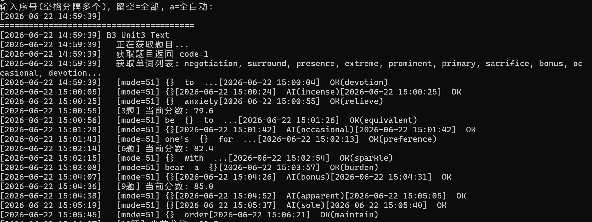

# Cidaren-AI

> 词达人班级任务自动化脚本：基于原版 cidaren 二次开发，集成 AI 大模型答题 + 空白试探兜底，修复 8 个核心 Bug

[](https://www.python.org/)
[](LICENSE)
[]()

**如果有帮助别忘了点个 Star**

---

## 目录

- [免责声明](#免责声明)
- [项目简介](#项目简介)
- [原版 Bug 与修复对照](#原版-bug-与修复对照)
- [核心原理](#核心原理)
- [快速开始](#快速开始)
  - [环境要求](#环境要求)
  - [抓取 UserToken](#抓取-usertoken)
  - [配置说明](#配置说明)
  - [运行方式](#运行方式)
- [命令参数速查](#命令参数速查)
- [运行流程图](#运行流程图)
- [配置项完整表](#配置项完整表)
- [推荐模型](#推荐模型)
- [常见问题](#常见问题)
- [注意事项](#注意事项)
- [致谢](#致谢)

---

## 免责声明

> **本项目仅供学习交流使用。请好好学英语，不要偷懒！** 我们学校老师并没有要求词达人任务，这个是帮一位朋友做的。英语是自己的，刷题工具只是辅助，真正的成长来自于认真背单词和练习。
>
> 作者：小明同学
>
> 本项目地址：<https://github.com/xm2284/Cidaren-AI>
>
> **最终免责**：本项目仅供学习研究，使用者自行承担风险。请合理使用，不要高频大批量刷题。



## 项目简介

Cidaren-AI 基于 [moningf/cidaren](https://github.com/moningf/cidaren) 二次开发，针对原版及社区常见分支存在的 8 个关键 Bug 逐一修复，并集成 **AI 大模型答题** 与 **自动获取单词列表** 功能，使答题正确率大幅提升。

主要特性：

- **纯 Python 标准库**，无第三方依赖，开箱即用
- **AI 优先 + 空白试探兜底**，双重保障正确率
- **自动获取任务单词列表**（ChoseWordList API），AI 从候选词中选词，不再凭空猜测
- **完善的重试与超时机制**，网络波动不卡死
- **兼容 Windows GBK 终端**，无 emoji 乱码
- **每轮自动重选词**，重置任务后单词列表同步更新

## 原版 Bug 与修复对照

| # | Bug 现象 | 根因 | 本项目修复 |
|---|---------|------|-----------|
| 1 | 70 多分任务显示"已完成"被跳过 | 判断逻辑 `over_status != 3 and score != 100 and progress != 100` 有误 | 改为 `score < 100` 判定 |
| 2 | 全自动模式 (`a`) 直接显示"全部完成" | `selected` 被设为空列表 | 自动选中所有 `score < 100` 任务 |
| 3 | 过期任务仍被拉出刷题 | 无过期检查 | 新增 `_is_task_expired()`，用 `start_time + over_time` 判断 |
| 4 | SSL/网络波动脚本卡死 | 无重试、无超时 | 5 次重试 + 递增等待（2s→6s）+ 20s 超时 + 关闭 SSL 验证 |
| 5 | 遇到 `code=20001` 选词后直接结束 | 选词后 `break`，当任务完成 | 选词后重新获取题目继续答题 |
| 6 | 学习卡片逐张等待极慢 | 串行等待跳过 | 批量快速跳过 mode=0 卡片，并行收集单词信息 |
| 7 | Windows 终端 emoji 报 `UnicodeEncodeError` | 直接输出 emoji | 纯 Python 脚本，无 emoji 输出 |
| 8 | 推理模型用 `reasoning_content` 当答案 | 字段理解错误 | 仅使用 `content` 字段作为答案 |

## 核心原理

```text
1. AI 优先答题
   题目内容 + 任务单词列表 → 大模型 API → 结构化答案

2. 空白试探兜底
   AI 失败 → 提交空答案 → 服务端返回正确答案 → 二次提交得分

3. 单词列表辅助
   每轮自动调用 ChoseWordList API 获取候选单词 → AI 从中选择

4. 自动重刷闭环
   一轮结束检查分数
     ├─ 满分 → 任务完成
     └─ 未满分 → 重置任务 → 重新选词 → 再刷（最多 10 轮）
```

## 快速开始

### 环境要求

- Python 3.7+
- 无需额外依赖（仅使用标准库：`json`、`urllib`、`ssl`、`time` 等）

### 抓取 UserToken

1. 下载 [Fiddler Classic](https://www.telerik.com/download/fiddler)
2. 打开 Fiddler → **Tools → Options → HTTPS**，勾选：
   - Capture HTTPS CONNECTs
   - Decrypt HTTPS traffic
   - 证书弹窗全部 Yes
3. **PC 微信**打开词达人 → 点进任意练习
4. Fiddler 左侧找到 `app.vocabgo.com` → 展开
5. 点开任意子请求 → **Inspectors → Headers**
6. 复制 `UserToken:` 后面那串 32 位字符

### 配置说明

**复制配置模板并填写（文件名必须是 `config.json`）：**

```bash
cp config.example.json config.json
```

**编辑 `config.json`：**

```json
{
  "user_token": "你的32位UserToken",
  "settings": {
    "delay_per_question": 2,
    "correct_rate_target": 100,
    "max_questions_per_run": 500
  },
  "ai": {
    "api_key": "你的AI API Key",
    "base_url": "https://token-plan-cn.xiaomimimo.com/v1",
    "model": "mimo-v2.5-pro",
    "enabled": true
  }
}
```

### 运行方式

```bash
# 验证 Token 有效
python cidaren.py --check

# 交互模式，手动选择任务
python cidaren.py

# 全自动刷所有待做任务
python cidaren.py --auto

# 只刷指定任务
python cidaren.py --task-id <任务ID>

# 全自动 + 含已完成任务（重刷）
python cidaren.py --all
```

## 命令参数速查

| 参数 | 作用 |
|------|------|
| (无参数) | 交互模式，手动选任务 |
| `--auto` | 全自动，刷所有 `score < 100` 且未过期的任务 |
| `--check` | 仅检查 Token 有效性 |
| `--task-id ID` | 只刷指定任务 ID |
| `--all` | 全自动 + 包含已完成（score=100）任务 |

## 运行流程图

```
获取班级任务列表
  ↓ 筛选 score < 100 且未截止
开始任务
  ↓ 获取单词列表 (ChoseWordList API)
  ↓ 批量跳过学习卡片 (mode=0)，收集单词
答题循环
  ↓ AI 优先：题目 + 单词列表 → 大模型 → 答案
  ↓ AI 失败 → 空白试探：空答案 → 服务端纠错 → 正确答案
一轮结束，检查分数
  ↓ 满分 → 完成
  ↓ 未满分 → 重置任务 → 重新选词 → 再刷（最多 10 轮）
```

## 配置项完整表

### settings

| 键 | 类型 | 默认值 | 说明 |
|----|------|--------|------|
| `delay_per_question` | int | 2 | 答题间隔秒数，建议 ≥ 2 避免风控 |
| `correct_rate_target` | int | 100 | 目标正确率（百分比），达到后停止重刷 |
| `max_questions_per_run` | int | 500 | 单次运行最大答题数，防死循环 |

### ai

| 键 | 类型 | 默认值 | 说明 |
|----|------|--------|------|
| `enabled` | bool | true | `true` 启用 AI 答题，`false` 仅空白试探 |
| `api_key` | string | — | OpenAI 兼容 API 密钥 |
| `base_url` | string | — | API 地址，必须包含 `/v1` |
| `model` | string | — | 模型名称 |

## 推荐模型

| 模型 | 服务商 | 特点 |
|------|--------|------|
| `mimo-v2.5-pro` | [小米 mimo](https://xiaomimimo.com/) | 推理模型，正确率高，适合英语题型 |
| `deepseek-chat` | [DeepSeek](https://platform.deepseek.com/) | 通用对话模型，速度快 |
| `deepseek-reasoner` | DeepSeek | 推理模型，逻辑题表现好 |

> 不配置 AI 也能运行，自动回退到空白试探法，但正确率较低。

## 常见问题

**Q：Token 多久过期？**
A：通常几小时到一天。过期后重新用 Fiddler 抓取即可。

**Q：运行时报 SSL 错误？**
A：脚本已内置关闭 SSL 证书验证，若仍报错请检查网络/代理设置。

**Q：AI 答题一直失败怎么办？**
A：检查 `api_key`、`base_url`、`model` 是否正确；网络不通时会自动回退空白试探。

**Q：能在 Linux/macOS 跑吗？**
A：能，纯 Python 标准库跨平台。

**Q：如何只刷某一门课的任务？**
A：交互模式下手动选择，或用 `--task-id` 指定。

## 注意事项

- 运行期间**不要用手机打开词达人**，否则 Token 可能失效
- Token 过期后需重新抓取
- 遇到"权限不足"的任务自动跳过（如未购买的课程）
- AI 答题需要网络连接 API 服务器，不稳定时自动回退空白试探
- `delay_per_question` 建议不低于 2 秒，避免触发风控

## 致谢

- 原项目：[moningf/cidaren](https://github.com/moningf/cidaren) — 空白试探法核心逻辑
- AI 模型：[小米 mimo](https://xiaomimimo.com/) — 推理模型答题